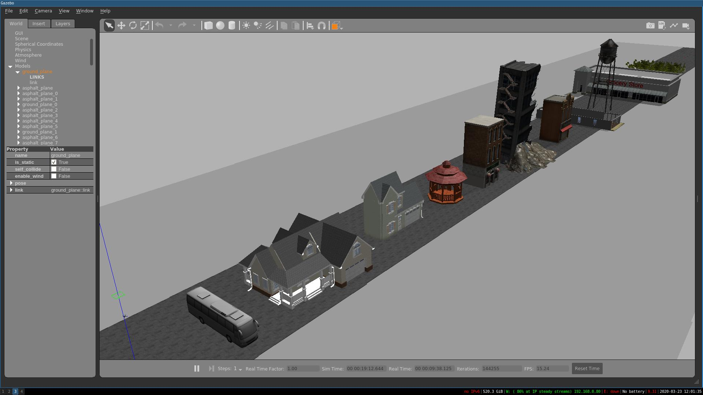
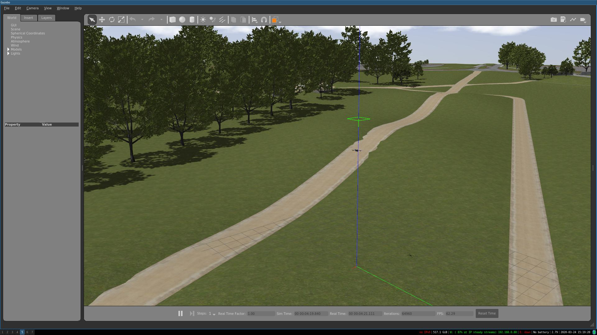

# trn_imitation_learning

##### Required other ROS packages: 
- PX4 Firmware (https://github.com/PX4/Firmware/)
- MAVROS (https://github.com/mavlink/mavros)
- sitl_gazebo (https://github.com/PX4/sitl_gazebo/)

#### Setup
Add baylands model to gazebo path. (Baylands model is from OSRF latest gazebo commit)

#### How to execute
` python data_gather.py` will hover the UAV at the start location at height 7m. 
`python tele_operation.py` will let us move the vehicle along the terrain.
The following keys are the mapped for desired effect:

                1. Space - starts moving the drone forward by 1m/s.
                2. Up - increase z velocity by 0.5 m/s
                3. Down - decrease z velocity by 0.5m/s
                4. Shift - go back to initial start location
                5. Esc - quit recording keys (EXIT)

#### Generate Disparity image

Run the following command to generate disparity images.

`rosrun topic_tools transform /stereo/disparity /stereo/disparity_image sensor_msgs/Image 'm.image'`

#### Screenshot

Urban Environment

Bayland Environment

